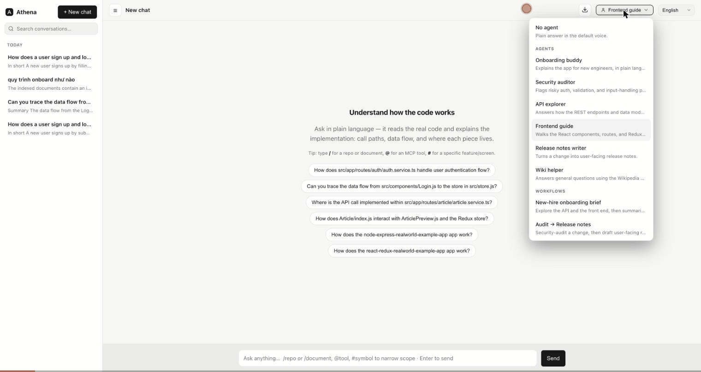
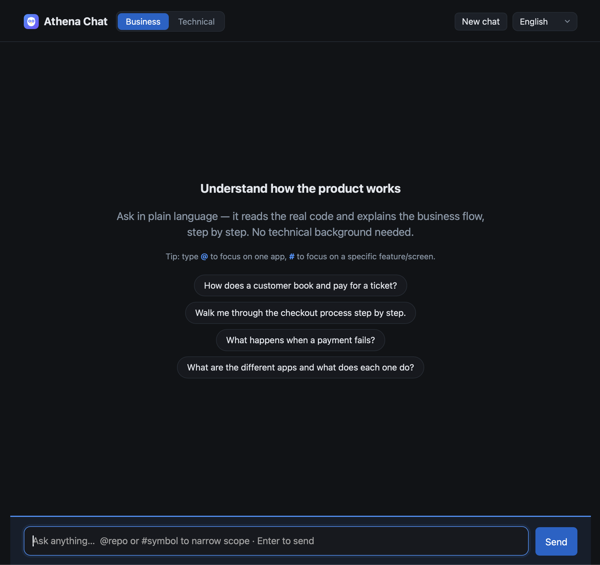
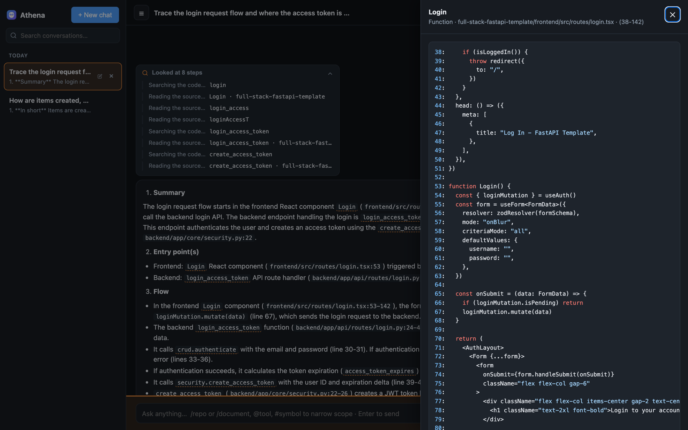
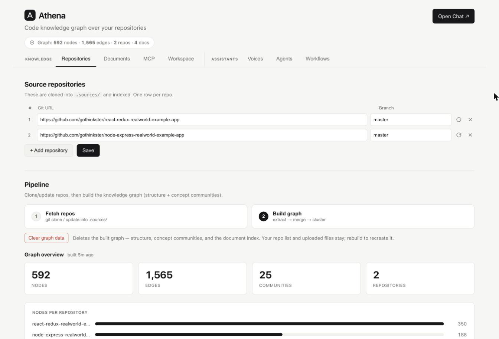
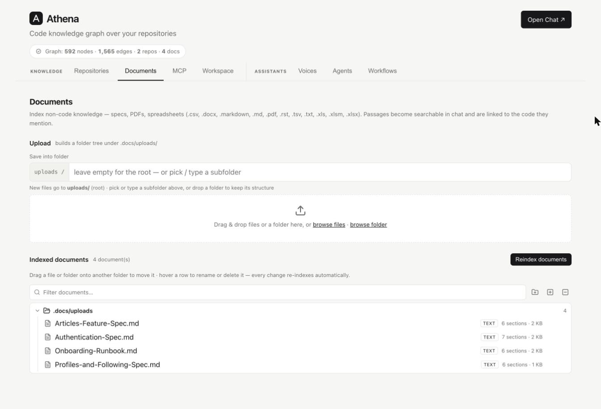
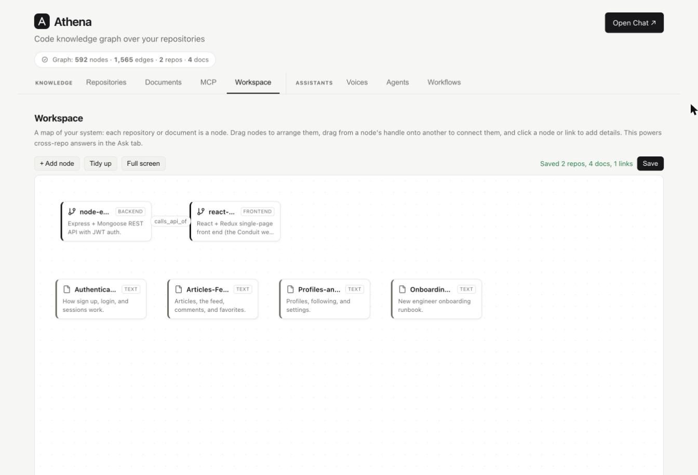
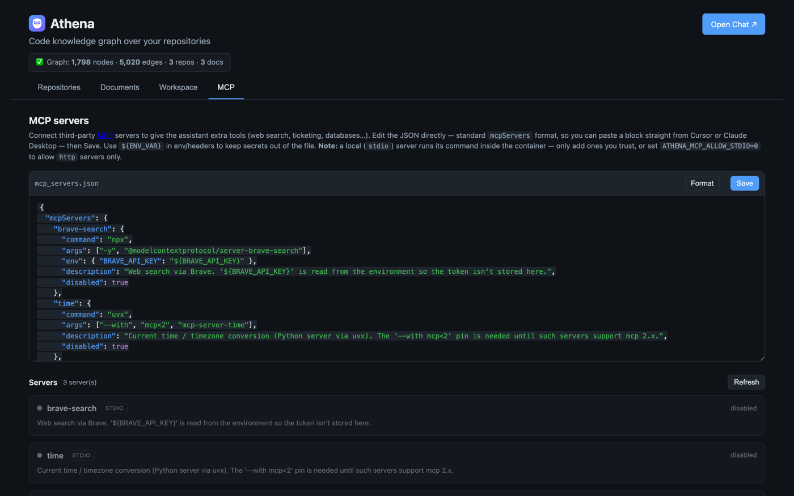
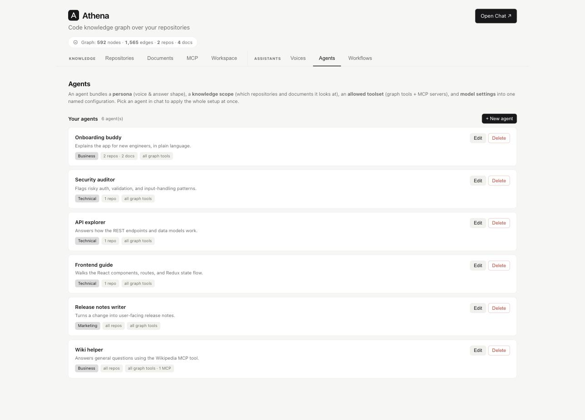
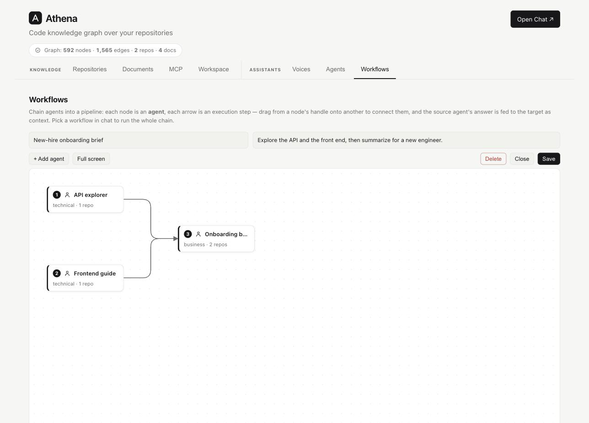

<h1> Athena</h1>

[](LICENSE)
[](https://www.python.org/)
[](https://modelcontextprotocol.io/)

**Turn your Git repositories into a queryable code knowledge graph — then ask
questions about how the product works in plain language.**

<p align="center"></p>

<p align="center"><em>One plain-language question → a live investigation trace → a step-by-step answer with a generated diagram → click a citation to open the real source. End to end.</em></p>

Athena ingests your Git repositories — and, optionally, your product documents
(specs, PDFs, spreadsheets) — extracts their structure (symbols, call/reference
edges, concept communities), and serves it over one shared query engine: a
**management dashboard**, a **chat app** with saved history, an **HTTP API**, and
an **MCP server**. The natural-language Q&A reads the _real_ source code — and the
docs you upload — and explains it for whatever audience you need, from business
stakeholders to developers. Compose that reasoning from three reusable building
blocks: **voices** (how an answer reads), **agents** (a voice bundled with a
knowledge scope, an allowed toolset, and model settings), and **workflows** (agents
chained into a pipeline) — all authored in the dashboard and picked with one click
in chat.

---

## Highlights

- **Ask in plain language** — the Q&A agent plans, searches the graph, reads the
  actual source (and your docs), and explains a flow step by step — citing where
  each thing lives. When something genuinely isn't in the indexed code, it **says
  so** instead of inventing a plausible-sounding answer.
- **See how it got there** — a live **investigation trace** shows every tool the
  agent ran and the file/symbol it read, so claims are traceable; it collapses to a
  one-line "Looked at N steps" you can expand. Each answer also shows the **tokens**
  it used, so the cost of a question is never a mystery.
- **Voices you can extend** — how an answer reads: built-in **Business**
  (non-technical, no jargon) and **Technical** (call paths, files, snippets), plus
  your own (Sales, Marketing, Support, …). Describe the reader and Athena writes the
  instruction, greeting, starter questions, and one-tap refine buttons — all editable
  in the dashboard's **Voices** tab.
- **Agents — a saved setup, one click** — bundle a voice + a **knowledge scope**
  (which repos/documents it reads) + an **allowed toolset** (graph tools + MCP
  servers) + **model settings** into one named agent. Pick it in chat to apply the
  whole configuration at once — e.g. a "Security auditor" scoped to your backend, or
  an "Onboarding buddy" in the Business voice.
- **Workflows — chain agents into a pipeline** — wire agents on a drag-and-drop
  canvas (nodes = agents, arrows = execution order). Running one feeds each step's
  answer to the next as context and streams a **single final result**, with live
  per-step progress in the trace.
- **Streaming, with next steps** — answers stream token by token with live status;
  each one offers **suggested follow-ups**, per-type **one-tap refinements**,
  regenerate, and edit-&-resend.
- **Jump into the code** — click a cited `path:line` or symbol to open its **real
  source** with callers/callees; click a document citation to read the exact passage.
- **Scope any question** — narrow with `/repo` or `/document`, `@tool` (a connected
  MCP tool), or `#symbol` (a specific feature/screen).
- **Bring your own docs** — upload specs, PDFs, or spreadsheets; they're chunked,
  embedded, searchable in chat, and automatically linked to the code symbols they
  mention — no full rebuild required.
- **Connect third-party tools** — register external **MCP servers** and let the
  agent call their tools mid-answer.
- **Built for reading** — Markdown + syntax-highlighted code, rendered **Mermaid**
  diagrams (with fullscreen zoom), copy / **export to Markdown**, a `⌘/Ctrl-K`
  command palette, and English / Tiếng Việt UI + response language.
- **Management dashboard** — grouped into **Knowledge** (Repositories, Documents,
  MCP, Workspace) and **Assistants** (Voices, Agents, Workflows). Add repos, build
  the graph (with **live progress** as it fetches, extracts, clusters, and indexes),
  describe repos and their **relations** (so cross-repo questions work), upload
  documents, and author the voices/agents/workflows chat draws on. A guided
  **first-run checklist** walks a new install to its first answer, and **Clear graph
  data** wipes the built graph to start over (your repos and uploads stay).
- **Saved history** — conversations persist server-side (SQLite); a sidebar lets you
  revisit, rename, and delete past chats.
- **Structured access too** — the same graph powers a **REST API** and an **MCP
  server** for editors and agents.

## See it in action

**Ask in plain language.** Athena plans, searches the graph, reads the real source
(and your docs), and answers step by step — with an expandable investigation trace
that shows every tool it ran, plus the tokens each answer cost.

<p align="center"></p>

**Jump straight into the code.** A technical answer cites `path:line` and symbols
you can click — Athena opens the real source in a side panel, with the callers and
callees to keep browsing.

<p align="center"></p>

**Manage it from one place.** The dashboard groups everything into **Knowledge**
(the sources Athena reasons over) and **Assistants** (how it reasons). Add
repositories and run the build pipeline — with live per-stage progress, a first-run
checklist for a fresh install, and a **Clear graph data** action to start over —
browse the documents you've indexed, map how your repos relate (for cross-repo
answers), and connect third-party MCP tools.

<table>
  <tr>
    <td width="50%"><br/><em>Repositories &amp; build pipeline, with a graph overview</em></td>
    <td width="50%"><br/><em>Documents — chunked, searchable, linked to code</em></td>
  </tr>
  <tr>
    <td width="50%"><br/><em>Workspace — map repos and their relations</em></td>
    <td width="50%"><br/><em>MCP — connect third-party tool servers</em></td>
  </tr>
</table>

**Compose the reasoning.** The **Assistants** group is where you author what chat
draws on — the voices an answer is written in, agents that bundle a voice with a
scope + toolset + model, and workflows that chain agents into a pipeline.

<table>
  <tr>
    <td width="50%"><br/><em>Agents — a voice + scope + toolset + model, saved</em></td>
    <td width="50%"><br/><em>Workflows — chain agents on a drag-and-drop canvas</em></td>
  </tr>
</table>

> The screenshots above are a live demo indexed on the open-source RealWorld
> ("Conduit") example apps — a React front end and an Express API.

## Architecture

```text
repos (config/sources.yaml)
   └─ L0 fetch         git clone → .sources/
      └─ L1 CodeGraph  multi-lang AST → structure           (npm: codegraph)
         └─ L4 Graphify cluster bridge → concept communities (pip: graphifyy)
            └─ L3 store  unified graph → .knowledge/graph.json (networkx)
               └─ L5 GraphQuery  ── MCP server   (src/query/server.py)
                                 ├─ HTTP API      (src/api/app.py, OpenAI Q&A)
                                 └─ NL Q&A        (src/query/ask.py)
                                      voices      (src/query/personas.py)
                                      agents      (src/query/agents.py — voice+scope+tools+model)
                                      workflows   (src/query/workflows.py — agents chained)

documents (uploads / config/docs.yaml)
   └─ L2 docs ingest   docx·pdf·csv·xls → passages, embedded, linked to code
                       (merged into the same graph; incremental reindex, no rebuild)

web front-ends
   :8000  dashboard  (dashboard/)          manage repos & docs, build, browse the graph
   :8100  chat app   (example/frontend +   ask questions, with saved history;
                      example/backend)     proxies Q&A to the API on :8000
```

Everything downstream of L5 depends only on **`GraphQuery`**. The two web apps
run as separate services — the dashboard is hosted by the API, and the chat app
is a thin stateful layer (SQLite) that proxies to it. See
[`INTEGRATION.md`](INTEGRATION.md) for embedding Athena into your own system.

## Quick start

**Prerequisites:** Python 3.10+ · Node 22.5+ (for the `codegraph` extractor) ·
an OpenAI API key (optional — only for natural-language Q&A).

```bash
# 1. Install
pip install -r requirements.txt
npm i -g @colbymchenry/codegraph        # L1 extractor (needs Node 22.5+)

# 2. Point Athena at your repos
#    edit config/sources.yaml  (see config/sources.example.yaml)

# 3. Build the knowledge graph  (fetch + extract + merge)
python src/main.py all                  # or: fetch | build

# 4. Enable natural-language Q&A
cp example.env .env                      # then set OPENAI_API_KEY

# 5. Run the management dashboard + API
python -m uvicorn api.app:app --app-dir src            # → http://127.0.0.1:8000

# 6. Run the chat app (persists history; proxies Q&A to the API above)
python -m uvicorn app:app --app-dir example/backend    # → http://127.0.0.1:8100
```

Open <http://127.0.0.1:8000> to manage repos, build the graph, and browse it, and
<http://127.0.0.1:8100/chat> for the chat UI with saved conversation history.
Without `OPENAI_API_KEY` the graph and structured search still work — only the
natural-language Q&A is disabled.

### Docker

The image bundles everything the pipeline needs — Python deps, the `codegraph`
CLI (Node 22), Graphify, and `git`/`ssh` for cloning repos. Compose runs two
services from the one image: the **dashboard + API on 8000** and the **chat app
on 8100**. Requires Docker with Compose v2.

```bash
# 1. Config the container mounts from the host. Compose mounts the whole config/
#    folder, so you only need your repo list — everything else (workspace, MCP,
#    personas) is created there at runtime.
cp example.env .env                                     # then set OPENAI_API_KEY
cp config/sources.example.yaml config/sources.yaml      # your repos (editable later from the UI)
mkdir -p config .sources .knowledge                     # config + cloned repos + built graph

# 2. Build the image and start both services.
docker compose up --build                 # dashboard :8000 · chat :8100/chat  (Ctrl-C to stop)
#   or run detached:  docker compose up --build -d

# 3. Build the knowledge graph (fetch + extract + merge). Either click through the
#    web UI at http://localhost:8000, or run the pipeline inside the container:
docker compose exec athena python src/main.py all
```

Notes:

- **Private repos over SSH** — Compose mounts `~/.ssh` read-only so the container
  can clone `git@…` remotes with your keys.
- **Persistence** — the `config/` folder, `.sources/`, and
  `.knowledge/` are bind-mounted, so your config and the built graph survive
  `docker compose down` and rebuilds. Chat history lives on the `chat-data`
  volume (SQLite), so conversations survive restarts too.
- **Live code edits** — `src/`, `dashboard/`, and `example/` are mounted; apply
  changes with `docker compose restart` (no rebuild needed).
- **Q&A** — as with the local setup, without `OPENAI_API_KEY` in `.env` only the
  graph and structured search work; natural-language Q&A stays disabled.

Stop and clean up with `docker compose down`.

## Configuration

Copy `example.env` to `.env` (loaded automatically by the API and MCP server).

| Variable                     | Default                  | Purpose                                                                   |
| ---------------------------- | ------------------------ | ------------------------------------------------------------------------- |
| `OPENAI_API_KEY`             | —                        | LLM API key. Enables Q&A; unset → structured search only.                 |
| `ATHENA_API_BASE`            | —                        | OpenAI-compatible endpoint (Ollama, vLLM, OpenRouter, …). Unset → OpenAI. |
| `ATHENA_API_KEY`             | —                        | Provider-agnostic key alias (wins over `OPENAI_API_KEY`).                 |
| `ATHENA_ASK_MODEL`           | `gpt-4.1-nano`           | Any tool-capable model on your provider.                                  |
| `ATHENA_EMBED_MODEL`         | `text-embedding-3-small` | Embedding model for document search (falls back to BM25 if no API key).   |
| `ATHENA_GRAPH`               | `.knowledge/graph.json`  | Path to the built graph.                                                  |
| `ATHENA_PERSONAS`            | `config/personas.yaml`   | Path to custom voices (answer types / personas).                          |
| `ATHENA_AGENTS`              | `config/agents.yaml`     | Path to saved agents (voice + scope + toolset + model bundles).           |
| `ATHENA_WORKFLOWS`           | `config/workflows.yaml`  | Path to workflows (agents chained into a pipeline).                       |
| `ATHENA_TEMPERATURE`         | `0.3`                    | Q&A sampling temperature; `none` to omit (reasoning models).              |
| `ATHENA_MAX_TOKENS`          | `2048`                   | Max tokens for a Q&A answer.                                              |
| `ATHENA_TOKENS_PARAM`        | `max_tokens`             | Token-limit param name (`max_completion_tokens` for o-series/gpt-5).      |
| `ATHENA_PARALLEL_TOOL_CALLS` | `true`                   | Batch independent tool calls; `false` if the model rejects it.            |
| `ATHENA_MAX_STEPS`           | `16`                     | Max tool-calling rounds per question.                                     |
| `ATHENA_TOOL_RESULT_CHARS`   | `12000`                  | Max chars of one tool result fed back (0 = uncapped).                     |
| `ATHENA_MAX_CODE_LINES`      | `400`                    | Max lines returned by one source read.                                    |
| `ATHENA_CODE_CONTEXT`        | `15`                     | Extra lines shown around a symbol.                                        |
| `ATHENA_IMPACT_DEPTH`        | `10`                     | Default hops for impact / blast-radius.                                   |
| `ATHENA_PATH_MAX_LEN`        | `20`                     | Default max hops for shortest-path search.                                |
| `ATHENA_MCP_ALLOW_STDIO`     | `1`                      | Allow local (stdio) MCP servers; `0` = remote http servers only.          |

## Voices, agents & workflows

Reasoning is composed from three building blocks, all authored in the dashboard's
**Assistants** group and picked with one click in chat.

**Voices** decide _how_ an answer reads. Two ship built in — **Business** (a
plain-language product story) and **Technical** (a precise code walkthrough) — and
you add your own in the **Voices** tab: describe the reader in one line and Athena
generates the instruction, greeting, starter questions, and one-tap refine buttons,
all editable. The shared investigation rigor, completeness bar, and diagram rules
wrap every voice automatically, so a new voice only defines its tone and structure.
Voices persist to `config/personas.yaml` (see
[`config/personas.example.yaml`](config/personas.example.yaml)).

**Agents** decide _who_ is answering and _what_ it may use. An agent bundles a base
voice + a **knowledge scope** (which repos/documents it reads) + an **allowed
toolset** (built-in graph tools + which MCP servers) + **model settings**
(model/temperature/step budget) into one saved configuration. Selecting an agent in
chat applies that whole setup at once, instead of re-picking a voice, scoping repos,
and choosing tools every time. Agents persist to `config/agents.yaml`.

**Workflows** chain agents into a pipeline. Build one on a drag-and-drop canvas
(nodes = agents, arrows = execution order); running it walks the graph in dependency
order, feeds each step's answer to its successors as context, and streams a single
final answer — with live per-step progress in the trace. Workflows persist to
`config/workflows.yaml`. All three are served over `/api/personas`, `/api/agents`,
and `/api/workflows`, so an editor or agent can manage them too.

## HTTP API

| Method  | Path                                     | Purpose                                        |
| ------- | ---------------------------------------- | ---------------------------------------------- |
| GET     | `/api/status`                            | graph stats, repos, whether Q&A is available   |
| GET/PUT | `/api/sources`                           | read / write `config/sources.yaml`             |
| POST    | `/api/fetch` · `/api/build`              | start pipeline jobs → `{job_id}`               |
| GET     | `/api/jobs/{id}`                         | job status + live stage progress               |
| DELETE  | `/api/graph`                             | clear the built graph (keeps repos & uploads)  |
| GET     | `/api/search?q=&repo=&type=`             | symbol search                                  |
| GET     | `/api/symbol/{id}` · `/api/impact/{id}`  | detail · blast radius                          |
| GET     | `/api/communities?q=`                    | concept clusters                               |
| GET     | `/api/docs`                              | list indexed documents                         |
| POST    | `/api/docs/upload` · `/api/docs/reindex` | upload a file · reindex the docs layer         |
| GET     | `/api/docs/search?q=`                    | search document passages                       |
| POST    | `/api/ask` `{question[,agent,workflow]}` | natural-language answer (+ tool trace)         |
| POST    | `/api/ask/stream` `{…}`                  | same, streamed as Server-Sent Events           |
| GET     | `/api/personas`                          | list voices (built-in + custom)                |
| POST    | `/api/personas`                          | create / update a custom voice                 |
| DELETE  | `/api/personas/{id}`                     | delete a custom voice                          |
| POST    | `/api/personas/generate` `{description}` | draft a voice's instruction from a description |
| GET     | `/api/agents` · `/api/agents/tools`      | list agents · list the building blocks         |
| POST    | `/api/agents`                            | create / update an agent                       |
| DELETE  | `/api/agents/{id}`                       | delete an agent                                |
| GET     | `/api/workflows`                         | list workflows                                 |
| POST    | `/api/workflows`                         | create / update a workflow                     |
| DELETE  | `/api/workflows/{id}`                    | delete a workflow workflow                     |
| DELETE  | `/api/workflows/{id}`                    | delete a workflow                              |

The chat app (`example/backend`, :8100) adds conversation + history endpoints
(`/api/conversations…`) on top of this API — see
[`example/backend/README.md`](example/backend/README.md).

## Examples

> The snippets below use placeholder repos, symbols, and questions — swap in your
> own. See `config/*.example.*` for the full config templates.

### Point Athena at your repositories

`config/sources.yaml` (copy from `config/sources.example.yaml`):

```yaml
repositories:
  - url: https://github.com/example/web-app.git
    branch: main
  - url: git@github.com:example/billing-service.git # SSH remote for a private repo
    branch: develop
```

Then build the graph with `python src/main.py all` (or click **Build** in the
dashboard).

### Query the HTTP API

```bash
# Structured symbol search
curl "http://127.0.0.1:8000/api/search?q=PaymentService&type=Class"

# Natural-language question — JSON answer plus the tool trace
curl -X POST http://127.0.0.1:8000/api/ask \
  -H "Content-Type: application/json" \
  -d '{"question": "How does checkout charge a customer?"}'

# Same question, streamed as Server-Sent Events
curl -N -X POST http://127.0.0.1:8000/api/ask/stream \
  -H "Content-Type: application/json" \
  -d '{"question": "Where is user authentication handled?"}'
```

### Questions that work well

- _"How does a new user sign up, end to end?"_
- _"What breaks if I change the `Invoice` model?"_ — impact / blast radius
- _"Which services talk to the payments module?"_ — cross-repo relations
- _"Summarize the billing flow for a non-technical stakeholder."_ — Business type

## MCP server

Registered in `.mcp.json` as `athena`. Tools: `overview`, `search_symbols`,
`get_symbol`, `neighbors`, `callers`, `callees`, `impact`, `find_path`,
`list_communities`, `community_members`.

```bash
python src/query/server.py     # stdio; ATHENA_GRAPH=/path/to/graph.json
```

To connect an editor or agent (Claude Desktop, Cursor, …), point its MCP config
at the server over stdio:

```json
{
  "mcpServers": {
    "athena": {
      "command": "python",
      "args": ["src/query/server.py"],
      "env": { "ATHENA_GRAPH": ".knowledge/graph.json" }
    }
  }
}
```

## Embed the query engine

```python
from query.engine import GraphQuery

q = GraphQuery(".knowledge/graph.json")
q.search_symbols("PaymentService", type="Class")
q.impact("cg:<repo>:class:<hash>", depth=2)      # change blast radius
```

## Project layout

```text
config/                system config — sources/workspace/docs/personas .yaml +
                       mcp_servers.json (runtime files gitignored; *.example.* tracked)
src/
  main.py              pipeline CLI (fetch | build | all)
  config.py            env + paths (config/ dir lives here)
  extractors/          L1 CodeGraph + L4 Graphify adapters
  graph/               merge, schema, NetworkX store
  query/
    engine.py          GraphQuery — the shared query surface
    ask.py             natural-language Q&A (agentic, streaming)
    personas.py        voices (answer "types") — registry + generator
    agents.py          agents — voice + scope + toolset + model bundles
    workflows.py       workflows — agents chained into a pipeline + runner
    server.py          MCP server
  api/app.py           FastAPI HTTP API + management dashboard host (:8000)
dashboard/             management web UI (served by the API) — Knowledge (repos,
  index.html · css/ · js/    docs, MCP, workspace) + Assistants (voices, agents, workflows)
example/
  frontend/            chat web UI (ES modules + CSS)
  backend/             chat service — conversations + history in SQLite (:8100)
```

## Contributing

Issues and pull requests are welcome. See [`CONTRIBUTING.md`](CONTRIBUTING.md)
for local setup and guidelines, [`CODE_OF_CONDUCT.md`](CODE_OF_CONDUCT.md) for
community expectations, and [`SECURITY.md`](SECURITY.md) to report a
vulnerability privately. Notable changes are recorded in
[`CHANGELOG.md`](CHANGELOG.md).

## License

Released under the MIT License — see [`LICENSE`](LICENSE).

